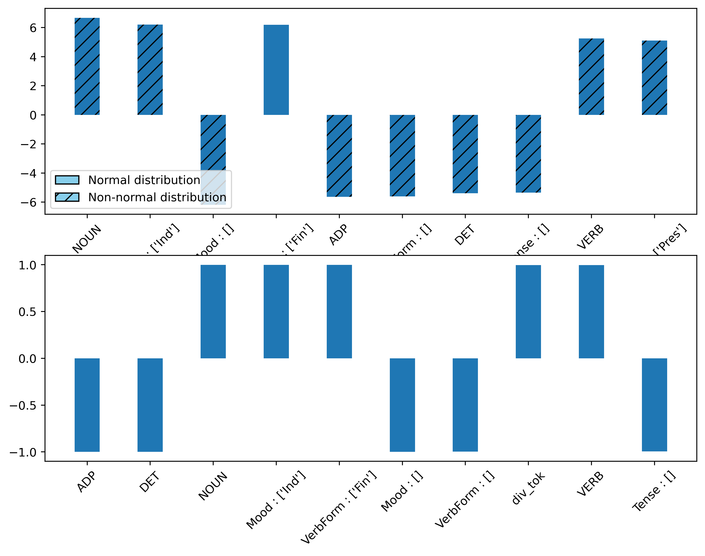

# Identification of Linguistic features, differentiating Wikipedia and Encyclopedia Universalis

This project aims to address the differences between Wikipedia and Encyclopedia Universalis writing styles.

## 1 - Wikipedia and Encyclopedia Universalis

Wikipedia and Encyclopedia Universalis are both encyclopedias, one written in a collaborative way, the other by one expert per article. The data of the Encyclopedia Universalis are not free, so I do not provide them. However, the one from Wikipedia are. You can check at the extraction and transformation of the data in the folder /main/preprocessing/

As a summary, we simply extract features such as the frequency of the Part of Speech, of the verbsforms etc. using SpaCy, in both Wikipedia and Encyclopedia Universalis.

The articles chosen in Wikipedia are the "good" and "featured" articles, as a comparison with poorly written articles of Wikipedia would be less informative, we beleive.

## 2 - Comparison of the articles.

Each article is reduce to a vector of the frequencies of it's linguistic components described above.
Once this is done, we perform two analysis :
1. Univariate Statistical analyses using cohen's D to rank the most differenciating features
2. Machine Learning analysis, as a Multivariate analysis, we also include a vector decomposition component that will help us understand the fundamental component in the texts
3. Component analysis : The step 2 gives us a set of fundamental dimension that differenciate the two sets of documents. We can visualize the most relevant component that help differenciate these two.

# Results

## 1. Statistical analysis

We observe that some properties are consistently more frequent in some text than some other.

This figure shows us the cohen's D (upper) and cliff's Delta (lower).
Because we can't really suppose a normality distribution of the data, we'll focus on cliff's Delta.
What we see is that there is indeed some features that are consistently more frequent that other in Wikipedia over Universalis (and vice versa).
Among them we see that Universalis is specific by its prevalence of Determinants and Adpositions, other that we don't see here are conjunct of coordination and of suboordination.
The formers (excluding determinants) underline a specific sentence construction, with less condensed forms of writing, longer sentences with multiple ideas in them.
On the other side we see that Wikipedia has more Nouns, Verbs a higher density of words and token, indicating a more semantically dense text, possibly less literaire, but more informative.

## 2. Machine Learning
