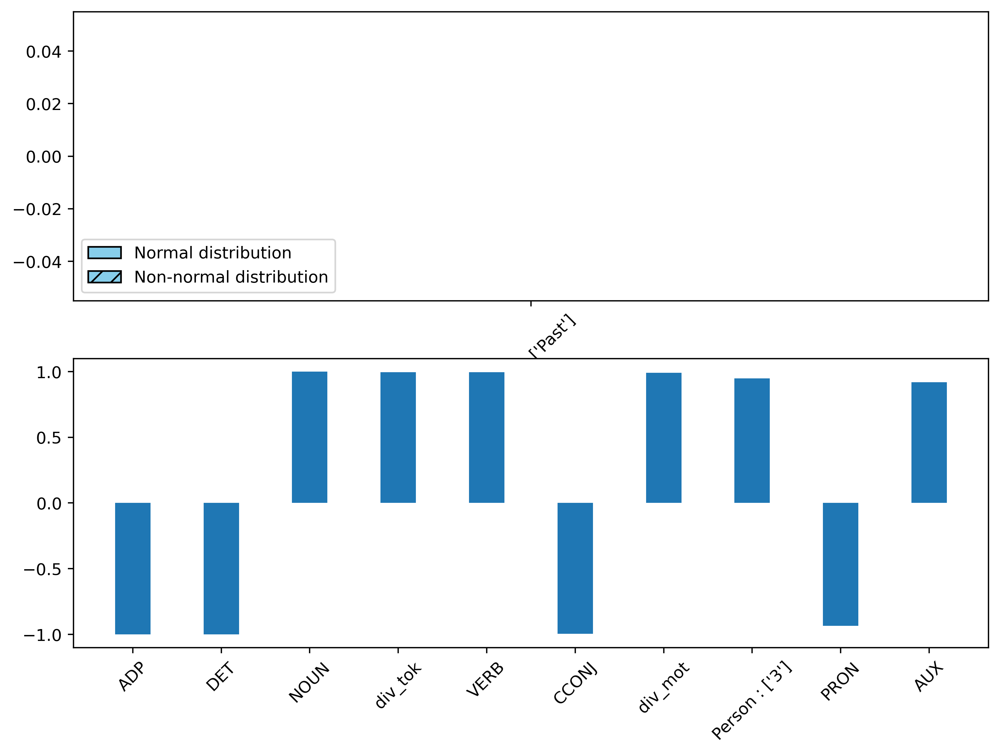

# Identification of Linguistic features, differentiating Wikipedia and Encyclopedia Universalis

This project aims to address the differences between Wikipedia and Encyclopedia Universalis writing styles.

## 1 - Wikipedia and Encyclopedia Universalis

Wikipedia and Encyclopedia Universalis are both encyclopedias, one written in a collaborative way, the other by one expert per article. The data of the Encyclopedia Universalis are not free, so I do not provide them. However, the one from Wikipedia are. You can check at the extraction and transformation of the data in the folder /main/preprocessing/

As a summary, we simply extract features such as the frequency of the Part of Speech, of the verbsforms etc. using SpaCy, in both Wikipedia and Encyclopedia Universalis.

The articles chosen in Wikipedia are the "good" and "featured" articles, as a comparison with poorly written articles of Wikipedia would be less informative, we beleive.

## 2 - Comparison of the articles.

Each article is reduce to a vector of the frequencies of it's linguistic components described above.
Once this is done, we perform two analysis :
1. Univariate Statistical analyses using cohen's D to rank the most differenciating features
2. Machine Learning analysis, as a Multivariate analysis, we also include a vector decomposition component that will help us understand the fundamental component in the texts
3. Component analysis : The step 2 gives us a set of fundamental dimension that differenciate the two sets of documents. We can visualize the most relevant component that help differenciate these two.

# Results

## 1. Statistical analysis

We observe that some properties are consistently more frequent in some text than some other.

This figure shows us the cohen's D (upper) and cliff's Delta (lower).
Because we can't really suppose a normality distribution of the data, we'll focus on cliff's Delta.
What we see is that there is indeed some features that are consistently more frequent that other in Wikipedia over Universalis (and vice versa).

Among them we see that Universalis is specific by its prevalence of Determinants and Adpositions, other that we don't see here are conjunct of coordination and of suboordination.
The formers (excluding determinants) underline a specific sentence construction, with less condensed forms of writing, longer sentences with multiple ideas in them.

On the other side we see that Wikipedia has more Nouns, Verbs a higher density of words and token, indicating a more semantically dense text, possibly less literaire, but more informative.

## 2. Machine Learning

For the Machine Learning we are interested in two things. 
First, can we learn two identify easily the two classes.
Second, can we learn intermediate representation on the way.

In our experiment, we find that yes we can learn to classify these two classes, with a model as simple as a LogisticRegression.
This is not very surprising given the findings in the last section.
We achieve, in a train-test setting, a balanced accuracy of 100%, showing that the model succeed to learn a perfect representation of the data.

As stated this is not surprising given the result of the last section, but this is surprising in the sens that such effects are generally not expected. 
It is true that reading both encyclopedia differences can be seen, but some preprocessing error could also be influential here.

We also find that, with or without PCA, the model performs perfectly.
This allow us to dig deeper and analyse the fundamental dimensions

## 3. PCA

Our model perform as well with 3 or 15 dimensions.
We will thus study only the two dimensions which are the more relevant for the model to identify class 0 and class 1, respectively Universalis and Wikipedia.

### Class 1 (Wikipedia) main dimension

The main dimension expressing Wikipedia articles depend principally over the diversity of the text.
Wikipedia display a way higher diversity of token compared to Universalis.
Second of all, this dimension depend heavily on Nouns and Verbs.
Last, this dimension rely on the passive voice.

THe first two observation indicate that we have many clause with Nouns and Verbs, and that these clause uses different vocabulary if possible. This also underline the idea that Universalis would be composed of more redundant vocabulary with less informative sentences.

The last observation is more of grammatical nature, which could be a mark of the neutrality / objectivity tone that Wikipedia tries to enforce as a guideline.

This dimension is also inversly correlated to Adpositions, Determinants, Active voice, Conjunctions and Auxiliaries.
This renforce our idea of dense and short sentences, because Adposition and Conjuctions are rejected. 

### Class 2 (Universalis) main dimension

The main dimension of Universalis is the one explaining the less the variance of the data, even though Universalis represent 20 times more articles than Wikipedia in our dataset !

This dimension is correlated to high density of Pronouns, Verbs, Subordinate, Imperative and Singular.
While we saw that Verbs are representing the first dimension pretty well, we find them here two, but with different companions.
Instead of Nouns, we have Pronouns and Subordinate.
Alors we have an indication toward which kind of sentence should we expect, with the Singular and the Imperative.

On the other side we have a reject of Plural and Present, of Adjectives and Nouns, and of the Indicative mood.
THis shows again a deeper stylistic difference in both encyclopedia.
